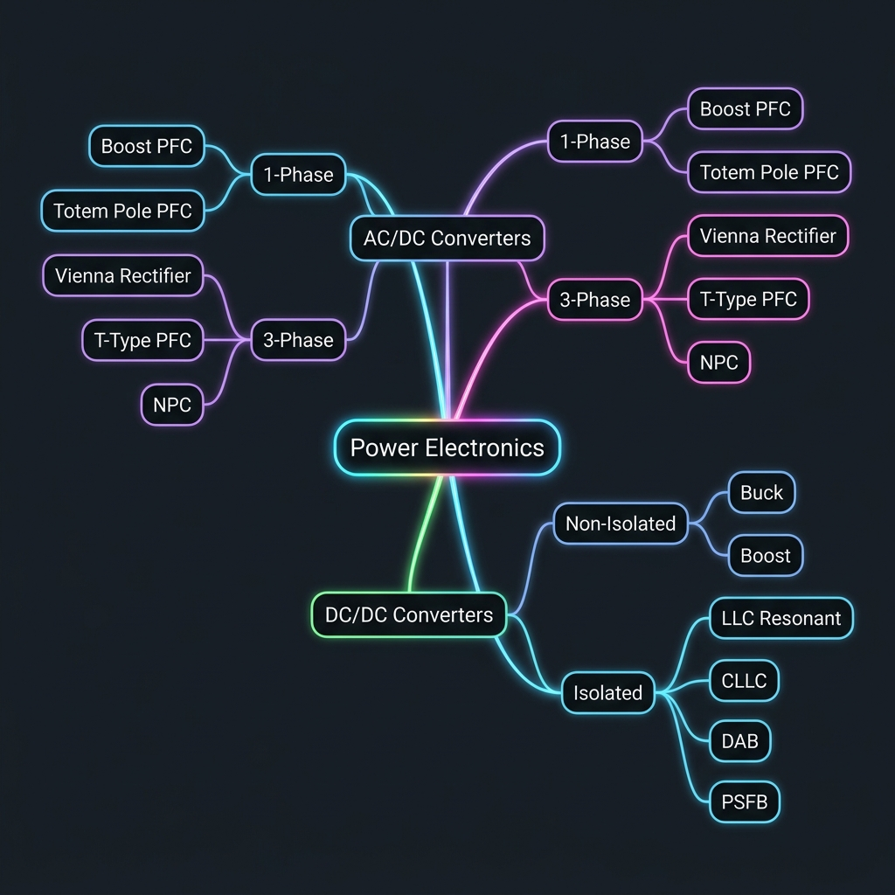
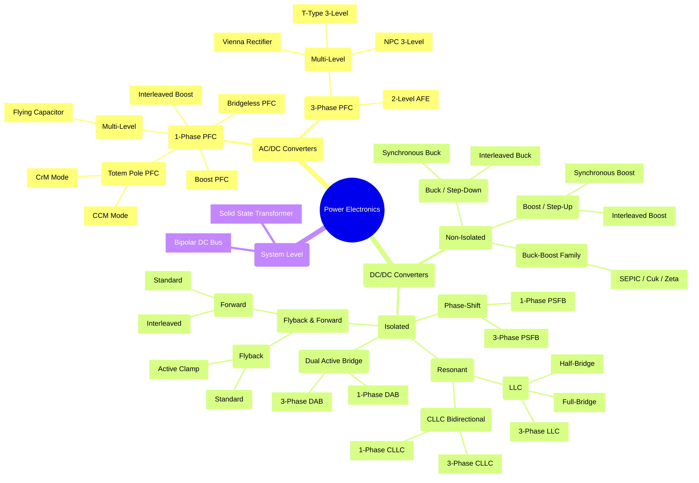

# Power Electronics Knowledge Systematization (PSIM & MATLAB)

The objective of this project is to build a structured repository for learning, systematizing knowledge, and simulating power electronics circuits from AC/DC to DC/DC. The structure is designed to be easily pushed to Git, managed by learning phases, and serve as an excellent reference manual.

## 1. Core Topologies

The project covers most circuit topologies from basic to advanced (heavily used in EV/Telecom).

### AC/DC (Rectifier / PFC)
*   **1-Phase PFC:**
    *   Diode Bridge + Boost PFC
    *   Interleaved Boost PFC
    *   Bridgeless PFC
    *   Totem Pole PFC (CCM / CrM)
    *   Flying Capacitor PFC
*   **3-Phase PFC:**
    *   2-level Active Front End (AFE)
    *   Vienna Rectifier
    *   T-type 3-level PFC
    *   NPC 3-level PFC

### DC/DC (DC-DC Converter)
*   **Non-Isolated:**
    *   Buck / Boost / Buck-Boost / SEPIC / Cuk
    *   Interleaved & Synchronous Buck/Boost
*   **Isolated:**
    *   Flyback (Standard, Active Clamp)
    *   Forward (Standard, Interleaved)
    *   LLC Resonant (Half-bridge, Full-bridge, 3-Phase)
    *   CLLC Resonant (Bidirectional)
    *   Phase-Shift Full Bridge (PSFB - 1 Phase & 3 Phase)
    *   Dual Active Bridge (DAB - 1 Phase & 3 Phase)

## 2. Execution Roadmap (Phases)

*   **Phase 1: PSIM Blocks (Visual & Basic)**
    *   Build the power stage.
    *   Use PSIM's built-in logic/control blocks.
*   **Phase 2: PSIM DLL (Embedded Code)**
    *   Write C code (similar to MCU firmware structure for TI C2000, etc.).
    *   Compile into DLL and embed it into PSIM to replace the logic blocks.
*   **Phase 3: MATLAB/Simulink (Advanced Control)**
    *   Simulate the entire system.
    *   Bode plots and control loop optimization.

## 3. Detailed Topology Mindmap (Mermaid)

## 4. Workflow Rules
* Keep progress updated in the `TODO.md` file.
* Write technical documentation inside the `docs/` directory.
* Save PSIM and MATLAB simulation files inside their respective Phase directories under `simulations/`.
