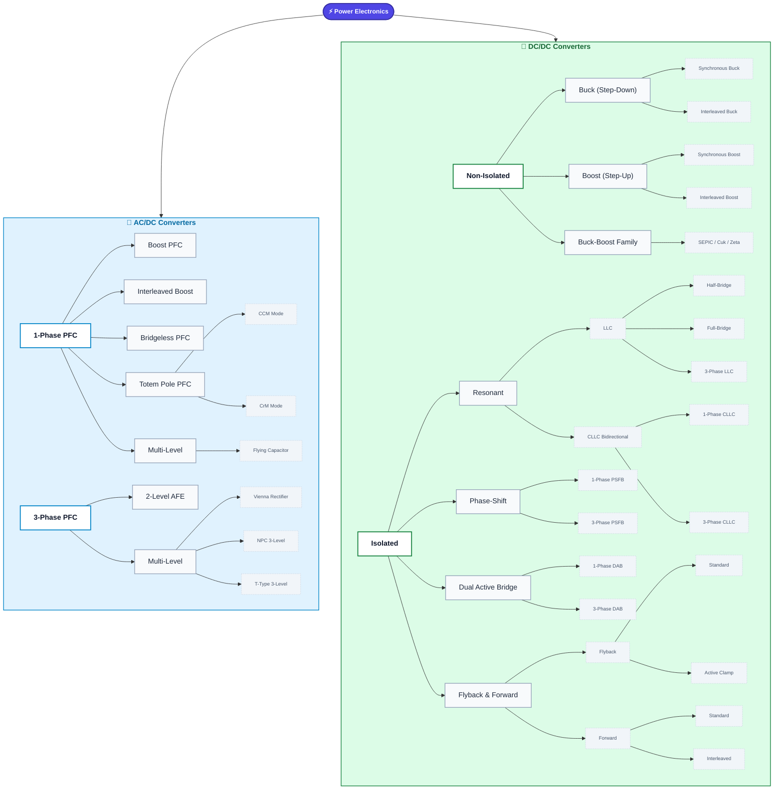

# Power Electronics System - From Theory to Practice

This project is a repository for storing, analyzing, and simulating Power Electronics converters from AC/DC to DC/DC. It focuses on high-efficiency converters widely used in Electric Vehicle (EV) Chargers, telecommunications, and renewable energy.

## 🚀 Execution Phases

The learning and design process for each Topology is divided into 3 phases:

1.  **Phase 1: PSIM Blocks** - Visual simulation using PSIM's built-in blocks. Verifies the power stage principles and basic control loop.
2.  **Phase 2: PSIM DLL** - Converts control blocks into C code (DLL). Helps understand embedded programming (writing code for MCU/DSPs like TI C2000, STM32) such as PI/PR controllers, PWM generation, and Phase-Shift.
3.  **Phase 3: MATLAB/Simulink** - In-depth system analysis, Bode Plot design, efficiency calculations, and control loop parameter optimization.

## 🧠 Topology Mindmap (Interactive)

The mindmap below outlines the topologies to be simulated, classified by family and variants.

## 📂 Directory Structure

*   `/docs/` - Theory, pros/cons, and modulation strategies for each topology.
*   `/simulations/`
    *   `/Phase_1_PSIM_Block/`
    *   `/Phase_2_PSIM_DLL/`
    *   `/Phase_3_MATLAB/`
*   `/scripts/` - Parameter calculation scripts (Python/MATLAB).

---
*This project is constantly updated. Check the `TODO.md` file for current progress.*
