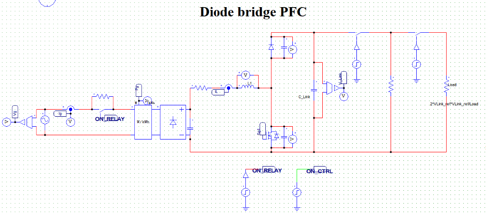
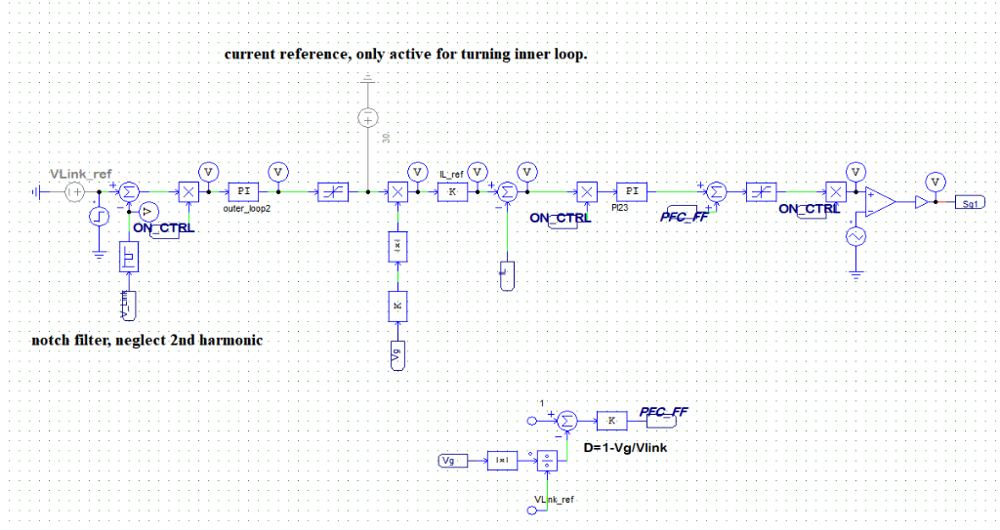
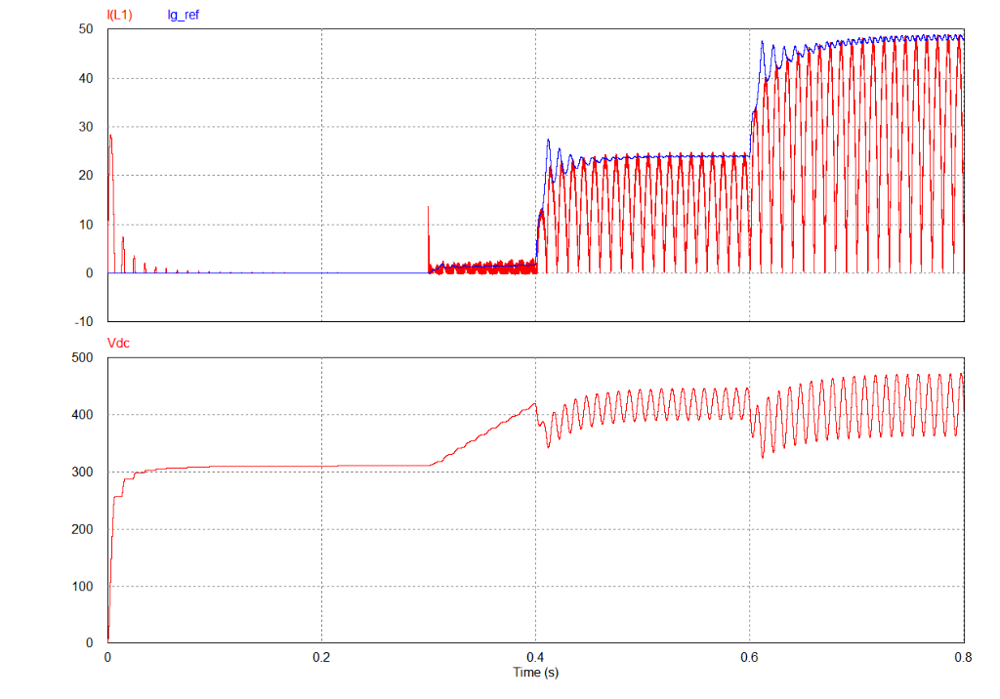

# Diode Bridge + Boost PFC - Simulation & Analysis

This document provides a theoretical overview and simulation results analysis for the 1-Phase Diode Bridge + Boost Power Factor Correction (PFC) topology.

## 1. Overview & Operating Principle

The Diode Bridge + Boost PFC is the most fundamental topology used for active power factor correction in single-phase applications. 

*   **Diode Bridge:** Rectifies the AC input voltage ($v_{ac}$) into a pulsating DC voltage ($|v_{ac}|$).
*   **Boost Stage:** Steps up the rectified voltage to a regulated DC link voltage ($V_{dc}$), which is higher than the peak of the AC input voltage.
*   **Control Objective:** Controls the inductor current ($I_{L1}$) to follow the shape and phase of the rectified input voltage, thereby achieving a Power Factor (PF) close to 1 and low Total Harmonic Distortion (THD), while regulating the output DC voltage ($V_{dc}$).

Below is the schematic diagram of the Diode Bridge + Boost PFC power circuit:

### Control Circuitry & Strategy
The controller utilizes **Average Current Mode Control (ACMC)** with a nested dual-loop structure:
*   **Outer Voltage Loop:** Compares the output voltage $V_{dc}$ (regulated via a PI controller) to the reference $V_{Link\_ref}$. A notch filter is implemented to eliminate the $100\text{ Hz}$ second-harmonic ripple from the voltage loop feedback, preventing it from distorting the line current command.
*   **Inner Current Loop:** Commands the inductor current to match the shape and phase of the rectified input voltage.
*   **Feedforward Control ($D_{FF}$):** A duty cycle feedforward block ($D = 1 - \frac{v_g}{v_{link}}$) is added to improve the dynamic response of the current loop under grid fluctuations.
*   **Tuning Mode:** A temporary constant current reference (e.g., $30\text{ V}$) is provided to decouple the outer loop and facilitate independent tuning of the inner current loop.

Below is the control circuit schematic implemented in the simulation:

---

## 2. Simulation Results & Waveform Analysis

The simulation represents the startup, soft-start, and dynamic load response of the Boost PFC converter.

### Simulation Timeline
*   **$0.0\text{ s} \to 0.2\text{ s}$ (Inrush Phase):** The AC grid charges the output bulk capacitor through the diode bridge and inrush current limiting resistors. $V_{dc}$ rises to the peak of the rectified AC grid voltage ($\approx 310\text{ V}$ for a $220\text{ V}_{rms}$ grid).
*   **$0.2\text{ s}$ (Relay ON):** The bypass relay turns ON, short-circuiting the inrush current limiting resistors to eliminate conduction losses during normal operation.
*   **$0.3\text{ s}$ (Controller ON & $V_{dc}$ Ramp Start):** The PFC controller is enabled, and the reference DC voltage ($V_{dc\_ref}$) starts to ramp up from the rectified peak voltage to the target output voltage (e.g., $400\text{ V}$).
*   **$0.4\text{ s}$ (50% Load Applied):** A $50\%$ load step is applied. $V_{dc}$ dips slightly but quickly recovers due to the closed-loop voltage control. The inductor current $I_{L1}$ rises to support the load power.
*   **$0.6\text{ s}$ (100% Load Applied):** An additional $50\%$ load step is applied (totaling $100\%$ full load). $V_{dc}$ experiences another brief dip and recovers. Inductor current $I_{L1}$ scales up accordingly.

### Waveform Visualizer
Below are the simulated waveforms of Inductor Current ($I_{L1}$), current reference ($I_{g\_ref}$), and output DC voltage ($V_{dc}$):

---

## 3. Advantages & Disadvantages

### Advantages
*   **Simplicity:** Simple power stage design with only one active switch (IGBT/MOSFET) and one boost diode.
*   **Low Cost:** Minimal component count makes it highly cost-effective for low-to-medium power applications.
*   **Maturity:** The control algorithms (e.g., Average Current Mode Control) are highly mature and widely available as dedicated ICs.

### Disadvantages
*   **High Conduction Losses:** The input current always flows through two bridge diodes and the boost stage, leading to significant conduction losses.
*   **Thermal Limits:** High thermal stress on the single boost diode and switch, limiting its usage in high-power applications (typically restricted to $< 1.5\text{ kW}$).
*   **No Bidirectional Capability:** Energy can only flow from the AC grid to the DC link.
