# 3-Level Flying Capacitor Totem-Pole PFC - Simulation & Analysis

This document provides a theoretical overview, design considerations, operating principles, and simulation results analysis for the **3-Level Flying Capacitor Totem-Pole Power Factor Correction (PFC)** topology. The analysis details the flying capacitor dimensioning, voltage balancing control strategy, and multi-level switching behavior.

---

## 1. Overview & Operating Principle

The **3-Level Flying Capacitor (FC) Totem-Pole PFC** is an advanced bridgeless PFC configuration. By using a flying capacitor to split the switching node voltage, it achieves three levels of output voltage ($V_{Link}$, $V_{Link}/2$, and $0$), which reduces the voltage stress on the high-frequency switching devices by half and significantly reduces the inductor current ripple.

### Converter Structure
The power stage consists of:
1.  **High-Frequency (HF) Leg:** Employs four fast-switching devices connected in series ($S_{HO}, S_{HI}, S_{LI}, S_{LO}$ from top to bottom) and a flying capacitor ($C_{fly}$) connected between the node between $S_{HO}$ & $S_{HI}$ and the node between $S_{LI}$ & $S_{LO}$. These switches are operated at high frequency (e.g., $50\text{ kHz}$) to shape the inductor current.
2.  **Low-Frequency (LF) Leg:** Employs two low-on-resistance switches ($S_P, S_N$) switching at the grid line frequency ($50\text{ Hz}$) to perform active rectification for the positive and negative half-cycles.
3.  **Boost Inductor ($L_1$):** Filters the high-frequency ripple of the input current.

Below is the schematic diagram of the 3-Level Flying Capacitor Totem-Pole PFC power circuit:

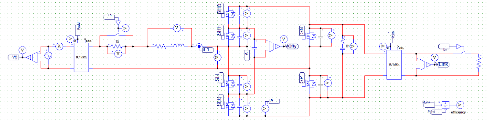

### Idealized Switching States and Conduction Paths

The converter operates differently depending on whether the instantaneous duty cycle $D$ is greater or less than $0.5$:
*   **$D > 0.5$ (Boost mode, high voltage region):** The switching node transitions between $V_{Link}/2$ and $V_{Link}$. The flying capacitor $C_{fly}$ alternates between charging and discharging.
*   **$D < 0.5$ (Boost mode, low voltage region):** The switching node transitions between $0$ and $V_{Link}/2$.

Below is the diagram showing the conduction states and current paths during the positive half-cycle of the grid:

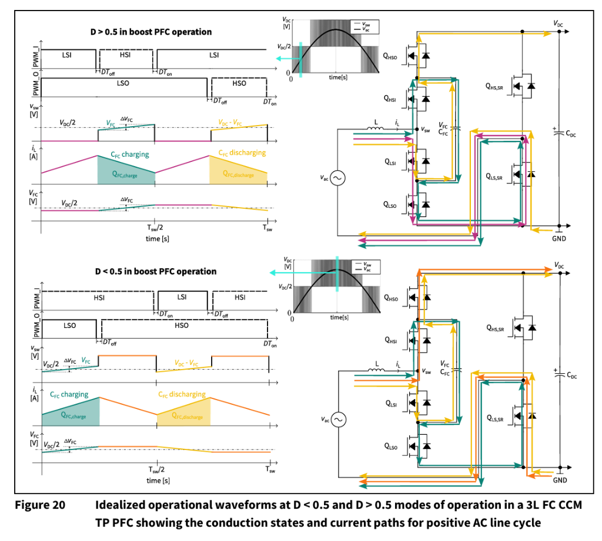

---

## 2. Flying Capacitor Dimensioning

The flying capacitor ($C_{fly}$) acts as a temporary energy storage buffer to maintain a voltage of $V_{cfly} \approx 0.5 \cdot V_{Link}$. The dimensioning of the capacitor depends on the switching frequency ($f_{sw}$), the maximum inductor current ($i_L$), and the maximum allowed voltage ripple ($\Delta V_{cfly}$).

### Dimensioning Equations
The following design equations describe the impact of these parameters on the sizing of the flying capacitor (based on worst-case charge transfer at a duty cycle $D = 0.5$):

$$\Delta Q_{FC} = i_L \cdot \Delta t$$

$$\Delta t = (0.5 - |D - 0.5|) \cdot T_{sw}$$

$$\Delta Q_{FC} = C_{FC} \cdot \Delta V_{FC}$$

$$C_{FC} \ge \frac{i_L}{\Delta V_{FC} \cdot 2 \cdot f_{sw}} \quad \text{at } D = 0.5$$

Where:
*   $i_L$ is the peak inductor current.
*   $f_{sw}$ is the switching frequency ($50\text{ kHz}$).
*   $T_{sw}$ is the switching period ($20\text{ }\mu\text{s}$).
*   $\Delta V_{FC}$ is the peak-to-peak voltage ripple of the flying capacitor.

Below is the design considerations summary from the manufacturer:

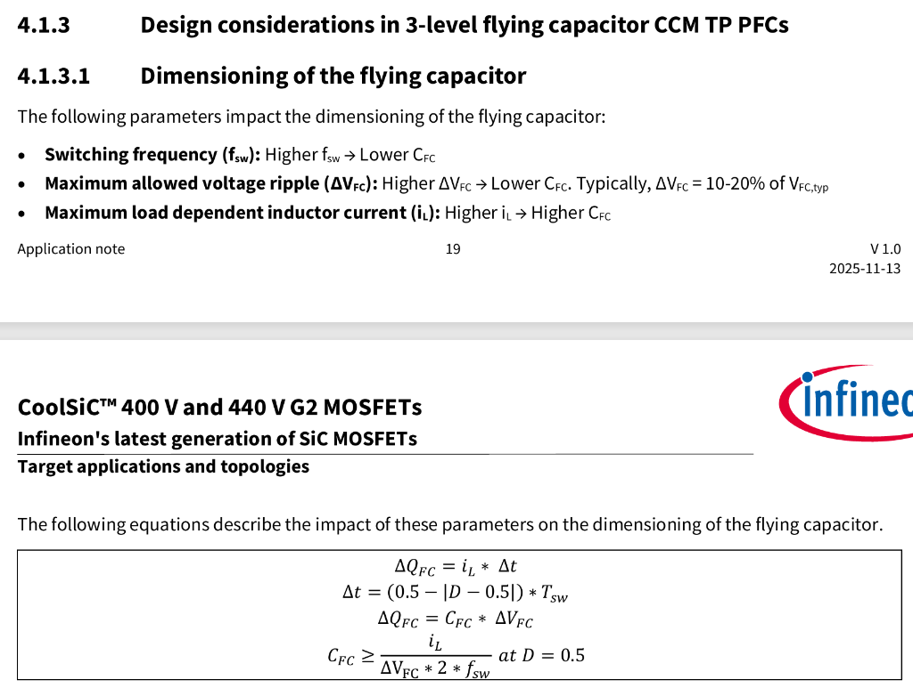

### Sizing Calculation
Given the user's design parameters:
*   Peak inductor current $i_{L,\max} = 50\text{ A}$
*   Switching frequency $f_{sw} = 50\text{ kHz}$
*   DC link voltage $V_{Link} = 800\text{ V}$ (Nominal $V_{cfly} = 400\text{ V}$)
*   Target voltage ripple on the flying capacitor is 10% of the DC link voltage: $\Delta V_{FC} = 80\text{ V}$

Applying the dimensioning formula at the worst-case duty cycle ($D=0.5$):

$$C_{FC} \ge \frac{50\text{ A}}{80\text{ V} \cdot 2 \cdot 50\text{ kHz}} = \frac{50}{8 \cdot 10^6} = 6.25\text{ }\mu\text{F}$$

To provide a sufficient safety margin and account for capacitor tolerance and voltage derating, a standard capacitor value of **$10\text{ }\mu\text{F}$** is selected.

---

## 3. Semiconductor Voltage Rating & IPC-9592-B Derating Guidelines

A key advantage of the 3-level flying capacitor topology is that during active operation, the high-frequency switches only block half of the DC bus voltage ($V_{DS,nom} = 0.5 \cdot V_{Link}$). This allows designers to select switches with lower drain-source breakdown voltage ($V_{(BR)DSS}$), which are significantly cheaper and have a much lower on-resistance ($R_{DS(on)}$) compared to the higher voltage switches required for standard 2-level converters (where a $400\text{ V}$ bus requires $650\text{ V}$ switches, and a $800\text{ V}$ bus requires $1200\text{ V}$ switches).

### IPC-9592-B Derating Standard
To ensure long-term reliability under environmental and electrical stress, power supply designs must comply with derating standards such as IPC-9592-B:
*   **Normal Operational Voltage:** The maximum continuous drain-source voltage must be derated to **$\le 80\%$** of the nominal $V_{(BR)DSS}$ for devices rated $>200\text{ V}$.
*   **Startup/Transient Voltage Spikes:** Single-event non-repetitive overvoltage spikes (such as those occurring during startup) must not exceed **$95\%$** of the maximum rating.

### Startup Voltage Stress without Pre-Charging
At cold startup (before the controller begins active switching and balancing), the flying capacitor $C_{fly}$ is uncharged ($0\text{ V}$).
*   In this state, the inner switches ($Q_{HSI}$ and $Q_{LSI}$) experience no overvoltage stress.
*   However, the outer switches ($Q_{HSO}$ and $Q_{LSO}$) must block the full input AC grid voltage peak or the DC link voltage.

#### Case A: $400\text{ V}$ DC Link Design ($V_{Link} = 400\text{ V}$)
For a system operating with a maximum input grid voltage of $305\text{ V}_{rms}$:
*   The peak AC voltage is $V_{ac,pk} = 305 \cdot \sqrt{2} \approx 431\text{ V}$.
*   If **no flying capacitor pre-charging** is implemented, the outer switches will experience a single-event startup stress of $431\text{ V}$.
*   To comply with the IPC-9592-B $95\%$ transient derating limit:
    $$V_{(BR)DSS,tr} \ge \frac{431\text{ V}}{0.95} \approx 454\text{ V}$$
*   This requirement is perfectly met by Infineon's extended voltage rated $440\text{ V}$ CoolSiC MOSFETs (e.g., IMT44R011M2H), which feature a DC breakdown rating of $V_{(BR)DSS} = 440\text{ V}$ and a transient breakdown rating of $V_{(BR)DSS,tr} = 455\text{ V}$ ($431\text{ V} / 455\text{ V} \approx 94.7\%$, satisfying the $95\%$ derating requirement without pre-charging).
*   During active operation, the switches only block $V_{Link}/2 = 200\text{ V}$, offering a highly conservative derating of $>50\%$.

#### Case B: $800\text{ V}$ DC Link Design ($V_{Link} = 800\text{ V}$)
For a system operating with an $800\text{ V}$ DC bus:
*   At startup, if the DC bus is pre-charged/energized to $800\text{ V}$ from the battery or output load side, the outer switches will experience the full $800\text{ V}$ stress if the flying capacitor is uncharged.
*   Applying the IPC-9592-B $95\%$ single-event limit:
    $$V_{(BR)DSS} \ge \frac{800\text{ V}}{0.95} \approx 842\text{ V}$$
*   **Without FC Pre-charging:** The designer must select switches rated for at least **$900\text{ V}$** (or $950\text{ V}$).
*   **With FC Pre-charging:** If the flying capacitor is actively pre-charged to $400\text{ V}$ at startup, the voltage stress across all switches is limited to $400\text{ V}$ at all times. Applying the normal $80\%$ operational derating guideline:
    $$V_{(BR)DSS} \ge \frac{400\text{ V}}{0.80} = 500\text{ V}$$
    This allows the use of much cheaper and lower-loss **$600\text{ V}$** or **$650\text{ V}$** switches instead of $900\text{ V}$ devices.

Below are the derating guidelines (Table 6), breakdown parameters (Table 7), and key startup considerations without pre-charging from the manufacturer's documentation:

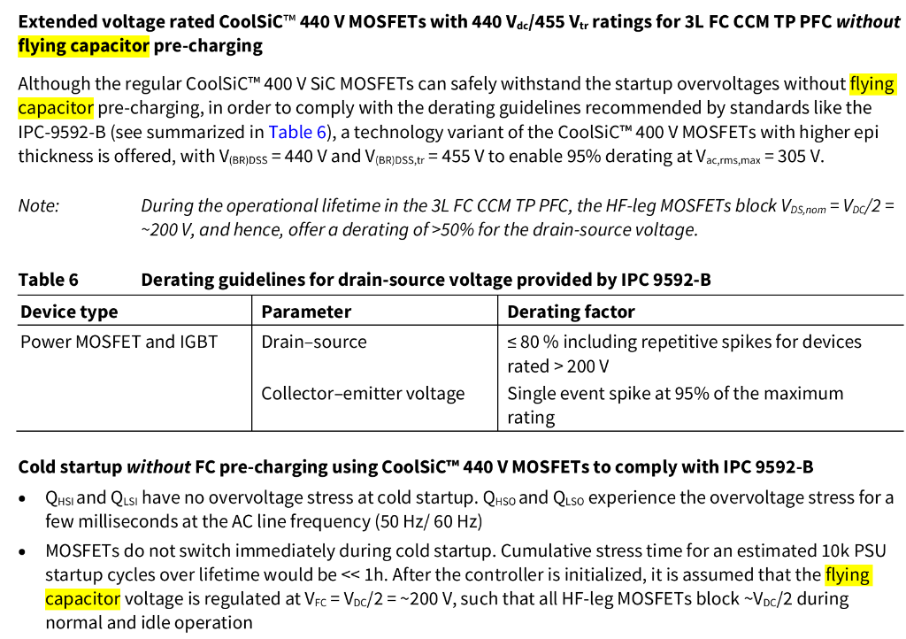

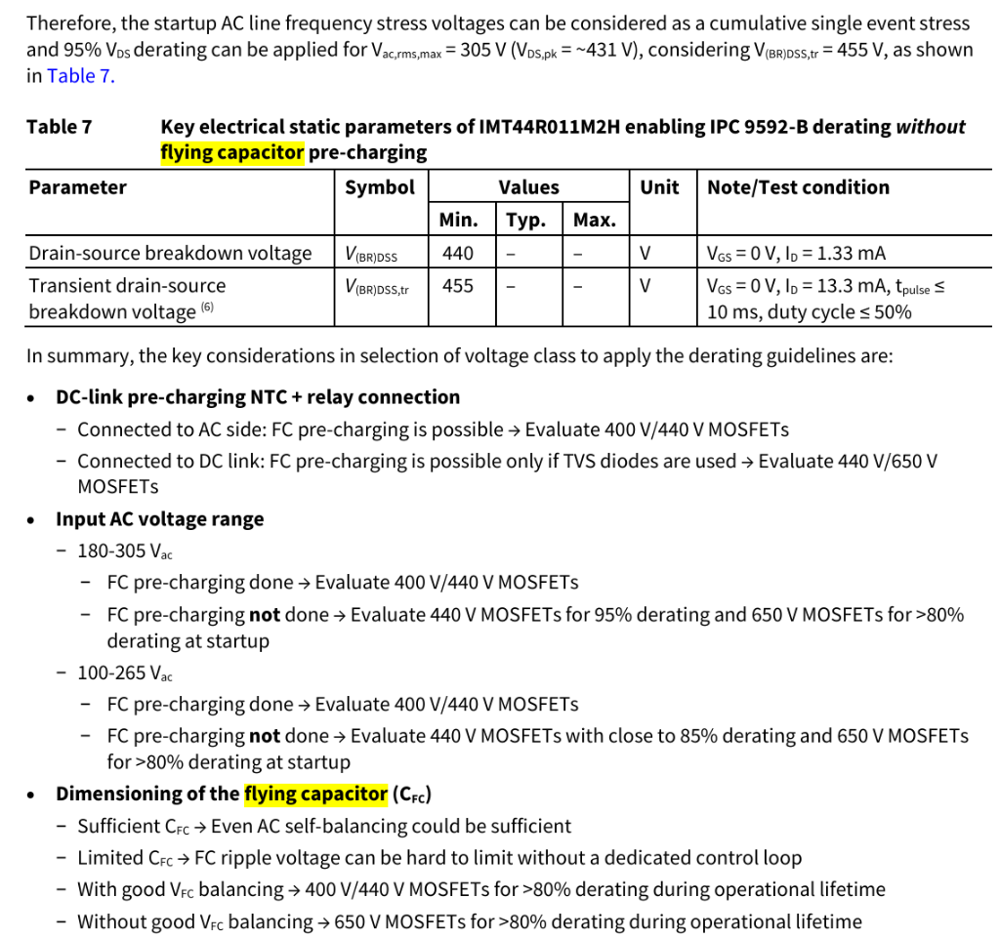

---

## 4. Flying Capacitor Voltage Balancing Control Strategy

To ensure proper 3-level operation and protect the switching devices from overvoltage, the flying capacitor voltage $V_{cfly}$ must be regulated at exactly half the DC link voltage ($V_{cfly} \approx 0.5 \cdot V_{Link}$).

### Active Balancing Controller
The charging and discharging of the flying capacitor depend on the switching states and the direction of the inductor current:
*   **State 1a ($S_{HI}=1, S_{HO}=0$):** Connects the switching node to the negative rail via $C_{fly}$. Inductor current charges $C_{fly}$ when $i_{L1} > 0$.
*   **State 1b ($S_{HI}=0, S_{HO}=1$):** Connects the switching node to the positive rail via $C_{fly}$. Inductor current discharges $C_{fly}$ when $i_{L1} > 0$.

An active balancing algorithm adjusts the duty cycle command of the individual switches:
1.  **Error Calculation:** The voltage error $e_{vfc}$ is first calculated, then normalized by $V_{Link}$:
    $$e_{vfc} = 2 \cdot V_{cfly} - V_{Link}$$
    $$e_{vfc\_norm} = \frac{2 \cdot V_{cfly} - V_{Link}}{V_{Link}}$$
2.  **Balancing Duty Cycle ($D_{balance}$):** To drive the error to zero, a correction duty cycle $D_{balance}$ is generated:
    $$D_{balance} = e_{vfc\_norm} \cdot \text{sign}(v_g)$$
    *Here, the multiplication by $\text{sign}(v_g)$ (grid polarity detection) ensures that the correction polarity is inverted during the negative half-cycle. This sign inversion is typically implemented in the PLL control block.*
3.  **Feedforward Duty Cycle ($D_{FF}$):** To improve current loop transient response, a polarity-dependent feedforward duty cycle is calculated based on the boost ratio:
    *   For $v_{ac} > 0$ (positive half-cycle):
        $$D_{FF} = 1 - \frac{|v_g|}{V_{Link}}$$
    *   For $v_{ac} < 0$ (negative half-cycle):
        $$D_{FF} = \frac{|v_g|}{V_{Link}}$$
4.  **PWM Modulation:** The balancing term is combined with the main PFC current loop duty cycle ($D_{PFC} + D_{FF}$):
    *   $D_1 = D_{PFC} + D_{FF} + D_{balance}$ (Compared with $car1$ to drive $S_{HI}$, inverted for $S_{LI}$)
    *   $D_2 = D_{PFC} + D_{FF} - D_{balance}$ (Compared with $car2$ to drive $S_{HO}$, inverted for $S_{LO}$)

This introduces a duty cycle mismatch that shifts the relative dwell times of States 1a and 1b, regulating the flying capacitor voltage back to its reference.

Below is the control system block diagram detailing the dual-loop control and the flying capacitor active voltage balancing block:

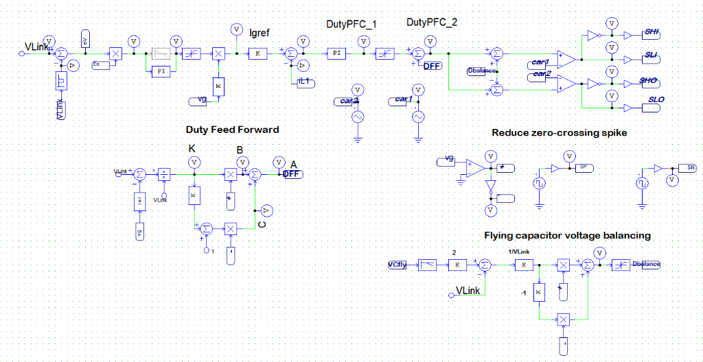

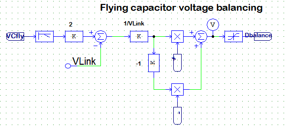

---

## 5. Simulation Results & Waveform Analysis

The multi-level operation and balancing control are validated through two simulation cases with different DC link voltage references ($V_{Link} = 800\text{ V}$ and $V_{Link} = 400\text{ V}$).

### Case 1: DC Link Voltage $V_{Link} = 800\text{ V}$

The simulated waveforms for the $800\text{ V}$ reference case are shown below:

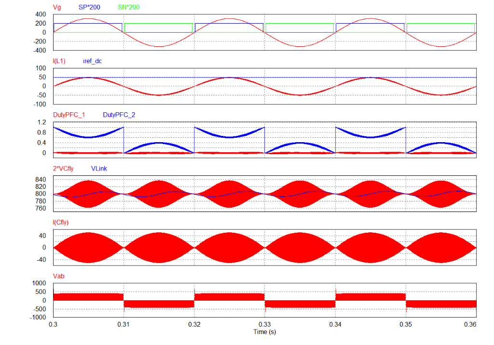

*   **Grid Voltage & LF Switch Pulses (Top Plot):** $V_g$ is sinusoidal ($311\text{ V}$ peak), and the low-frequency gate pulses $SP$ and $SN$ show the zero-crossing blanking zone to eliminate current spikes.
*   **Inductor Current (Second Plot):** $I(L_1)$ is regulated in phase with the grid voltage, reaching a peak of $50\text{ A}$.
*   **Flying Capacitor Voltage (Fourth Plot):** $2 \cdot V_{cfly}$ (red) is tightly regulated around $V_{Link} = 800\text{ V}$ (blue), confirming that $V_{cfly}$ is balanced at $400\text{ V}$. The peak-to-peak ripple of $2 \cdot V_{cfly}$ is $80\text{ V}$ ($\Delta V_{FC} = 40\text{ V}$), matching the target design limits.
*   **Switching Node Voltage $V_{ab}$ (Bottom Plot):** Since $v_g^{peak} = 311\text{ V} < 0.5 \cdot V_{Link} = 400\text{ V}$, the converter always operates in the lower half of the voltage range. Consequently, $V_{ab}$ switches only between $0\text{ V}$ and $+400\text{ V}$ during the positive half-cycle, and between $0\text{ V}$ and $-400\text{ V}$ during the negative half-cycle. This cuts switching stress and losses by half compared to a 2-level converter.

---

### Case 2: DC Link Voltage $V_{Link} = 400\text{ V}$

To demonstrate the full three-level capability of the converter, the DC link voltage is set to $400\text{ V}$, so the midpoint is $200\text{ V}$. The waveforms are shown below:

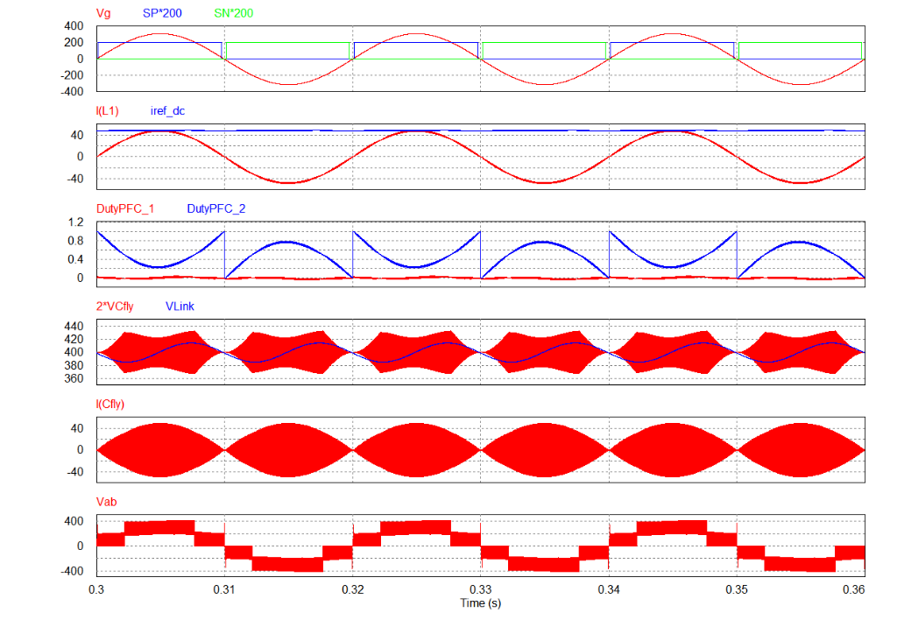

*   **Multi-level Switching Node Voltage $V_{ab}$ (Bottom Plot):** Since $v_g^{peak} = 311\text{ V} > 0.5 \cdot V_{Link} = 200\text{ V}$, the grid voltage exceeds the flying capacitor voltage during a portion of the line cycle.
    *   **Near Zero-Crossing ($v_g < 200\text{ V}$):** $V_{ab}$ switches between $0\text{ V}$ and $200\text{ V}$ (or $-200\text{ V}$ and $0\text{ V}$).
    *   **Near Peak Voltage ($v_g > 200\text{ V}$):** $V_{ab}$ switches between $200\text{ V}$ and $400\text{ V}$ (or $-400\text{ V}$ and $-200\text{ V}$).
    *   This confirms the true 3-level staircase switching characteristic, which dramatically reduces harmonic distortion.
*   **Flying Capacitor Voltage (Fourth Plot):** $2 \cdot V_{cfly}$ is regulated around $V_{Link} = 400\text{ V}$, indicating that $V_{cfly}$ is balanced at $200\text{ V}$ under transient voltage transitions.

#### Detailed Zoom-in Waveform Analysis at $V_{Link} = 400\text{ V}$

To clearly verify the 3-level operation and the reduced switch voltage stress, two zoomed-in simulation intervals are analyzed:

##### Zoom 1: High Instantaneous Grid Voltage ($v_g > 200\text{ V}$, near grid peak)
The waveforms for this interval (from $0.3049\text{ s}$ to $0.3051\text{ s}$) are shown below:

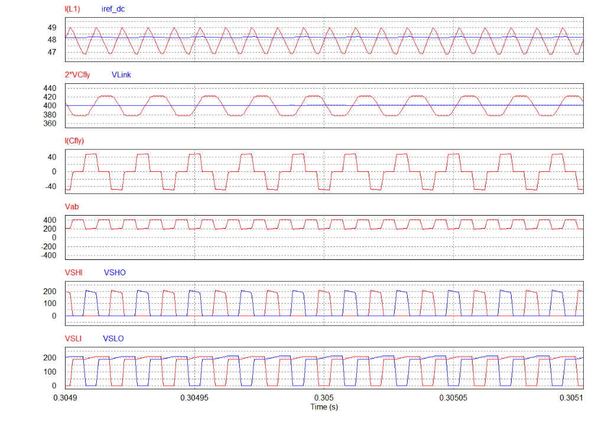

*   **Switching Node Voltage $V_{ab}$:** Switches between $200\text{ V}$ (the capacitor voltage $V_{cfly}$) and $400\text{ V}$ ($V_{Link}$).
*   **Switch Voltage Stress:** The drain-source voltages of the switches ($V_{SHI}, V_{SHO}$ and $V_{SLI}, V_{SLO}$) switch complementary and only block a maximum of **$200\text{ V}$** (which is $V_{Link}/2$).
*   **Capacitor Current $I(C_{fly})$:** Actively transitions between $+48\text{ A}$ (State 1a: charging), $0\text{ A}$, and $-48\text{ A}$ (State 1b: discharging), keeping the flying capacitor balanced.

##### Zoom 2: Low Instantaneous Grid Voltage ($v_g < 200\text{ V}$, near zero crossing)
The waveforms for this interval (from $0.3088\text{ s}$ to $0.3090\text{ s}$) are shown below:

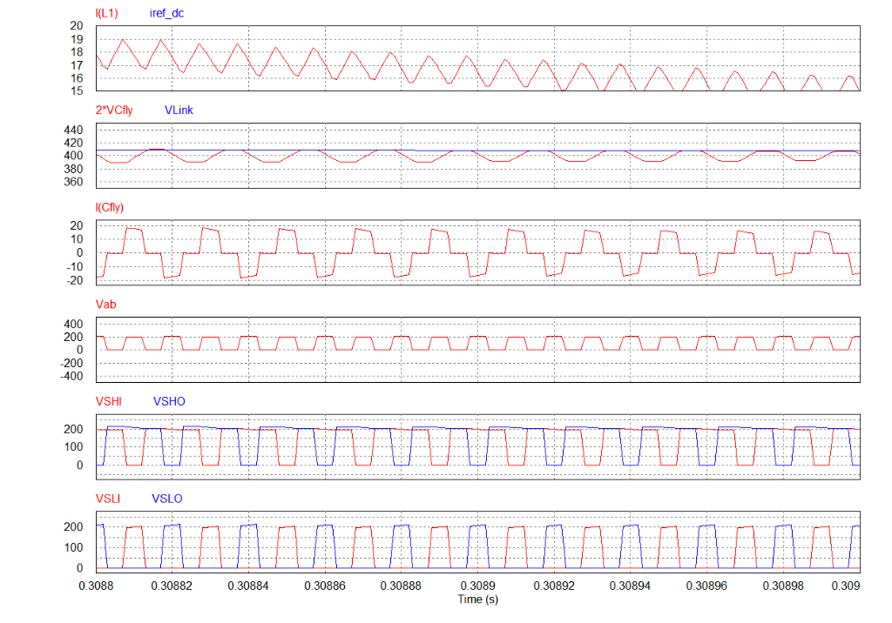

*   **Switching Node Voltage $V_{ab}$:** Switches between $0\text{ V}$ (ground) and $200\text{ V}$ (the capacitor voltage $V_{cfly}$).
*   **Switch Voltage Stress:** Again, the voltage stress on all individual switches never exceeds **$200\text{ V}$** (which is $V_{Link}/2$), demonstrating the half-voltage stress benefit during all switching cycles.
*   **Capacitor Current $I(C_{fly})$:** Transitions between $+17\text{ A}$ (State 1a), $0\text{ A}$, and $-17\text{ A}$ (State 1b) to maintain balancing.

---

## 6. Advantages & Disadvantages

### Advantages
*   **Reduced Switch Voltage Stress:** High-frequency switches only block $V_{Link}/2$ instead of the full $V_{Link}$ during active operation. This allows the use of lower voltage-rated devices:
    *   For a $400\text{ V}$ DC bus, we can use **$400\text{ V}$ or $440\text{ V}$** switches (instead of $650\text{ V}$).
    *   For a $800\text{ V}$ DC bus, we can use **$600\text{ V}$ or $650\text{ V}$** switches (instead of $1200\text{ V}$).
    These lower voltage devices exhibit significantly lower $R_{DS(on)}$, lower switching losses, and lower component cost.
*   **Improved Inductor Ripple and Size (2-Level vs. 3-Level):** Because the effective switching frequency is doubled and the switching voltage step is halved (switching between $V_{Link}$ and $V_{Link}/2$, or $V_{Link}/2$ and $0$), the peak-to-peak inductor current ripple $\Delta i_L$ is dramatically reduced.
    *   **Current Ripple Cancellation:** As shown in the comparison graph below, the peak ripple current of the 3-level flying capacitor topology is only **$25\%$ ($1/4$)** of a conventional 2-level topology for the same switching frequency and inductance value.
    *   **Design Degrees of Freedom:**
        *   *Case 1 (Optimize for Power Density):* By maintaining the same switching frequency as the 2L converter, the required inductance value can be reduced by 4 times ($L_{3L} = L_{2L}/4$), yielding a much smaller inductor volume and lower ESR.
        *   *Case 2 (Optimize for Efficiency):* By reducing the switching frequency of the 3L converter to half ($f_{sw,3L} = f_{sw,2L}/2$) to decrease high-frequency switching losses, the required inductance value is still reduced by 2 times ($L_{3L} = L_{2L}/2$).
    
    Below is the normalized ripple current comparison as a function of duty cycle and the design degrees of freedom table:

    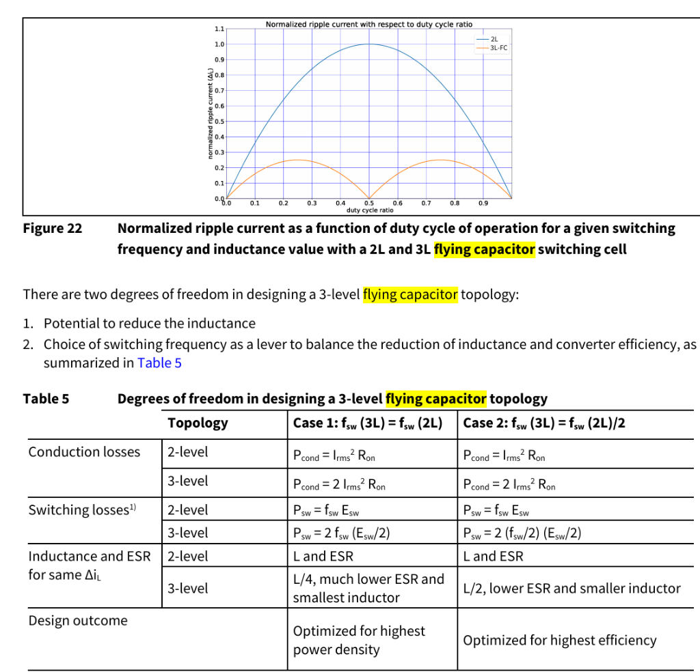
*   **Low EMI:** The smaller voltage steps reduce common-mode noise emissions.

### Disadvantages
*   **Control Complexity:** Requires an active closed-loop balancing algorithm to keep the flying capacitor voltage centered, as well as additional voltage sensors.
*   **Component Count:** Requires four high-frequency switches and a high-voltage flying capacitor.

---

## 7. References & Design Guidelines

For further theoretical details and implementation notes, refer to the following design guides:
*   [Infineon 3.3 kW 3-Level Flying Capacitor PFC Reference Design (REF-3K3W-3LFC-PSU)](https://www.infineon.com/assets/row/public/documents/24/42/infineon-reference-design-ref-3k3w-3lfc-psu-applicationnotes-en.pdf)
*   [Infineon CoolSiC 400 V and 440 V G2 MOSFETs Application Note](https://www.infineon.com/assets/row/public/documents/24/42/infineon-infineon-coolsic-400-v-and-440-v-g2-mosfets-an-en-applicationnotes-en.pdf)
*   [TI 3-Level PFC Design Guide (sdaa195)](https://www.ti.com/lit/an/sdaa195/sdaa195.pdf)
