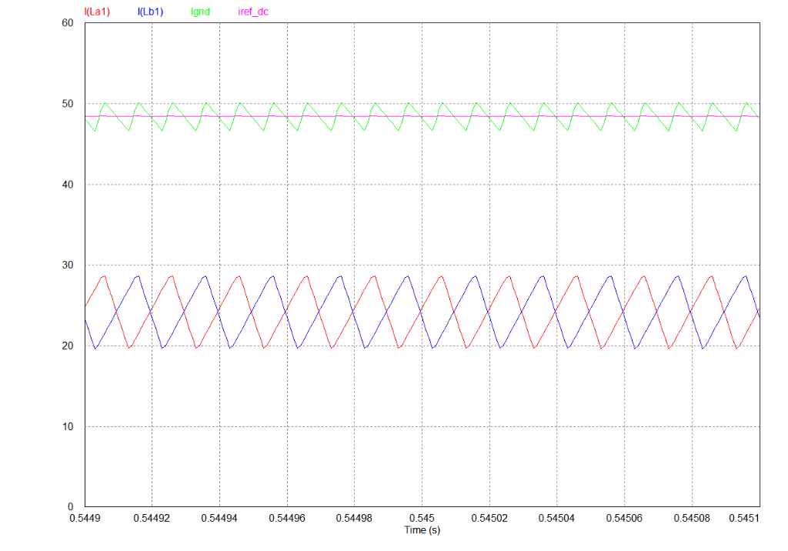
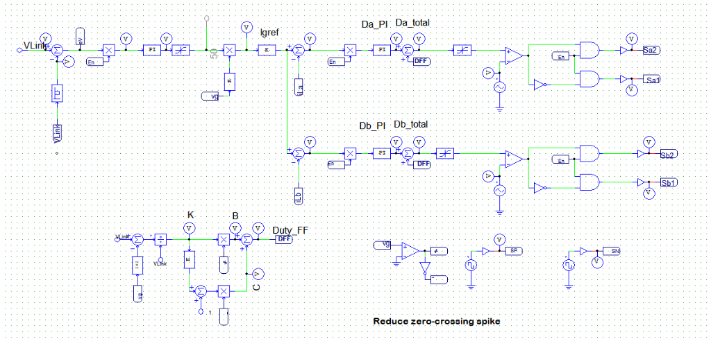
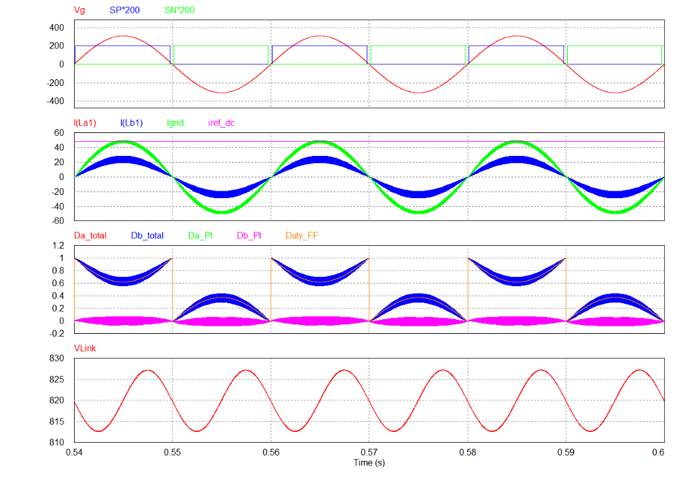

# Interleaved Totempole Boost PFC - Simulation & Analysis

This document provides a theoretical overview, operating principles, and simulation results analysis for the **2-Phase Interleaved Totempole Boost Power Factor Correction (PFC)** topology. The analysis highlights the current ripple cancellation mechanism achieved through interleaved PWM switching, as well as the power and control circuit layouts.

---

## 1. Overview & Operating Principle

The **Interleaved Totempole Boost PFC** combines the high-efficiency benefits of a bridgeless totem-pole configuration with the ripple-reduction benefits of interleaving. 

By running two high-frequency legs in parallel with a $180^\circ$ phase shift, the converter distributes the thermal stress over more components and significantly reduces the ripple of the grid current. This leads to a smaller and lighter electromagnetic interference (EMI) filter.

### Converter Structure
The power stage consists of:
1.  **Phase A High-Frequency Leg ($S_{a1}, S_{a2}$):** Switches at high frequency to control the Phase A inductor current ($i_{La}$).
2.  **Phase B High-Frequency Leg ($S_{b1}, S_{b2}$):** Switches at the same high frequency but with a $180^\circ$ phase delay, controlling Phase B inductor current ($i_{Lb}$).
3.  **Shared Low-Frequency Leg ($S_N, S_P$):** Switches at the line frequency ($50\text{ Hz} / 60\text{ Hz}$) to perform active line rectification.

Below is the schematic diagram of the 2-Phase Interleaved Totempole Boost PFC power circuit:

---

## 2. Ripple Cancellation Principle

Interleaving works by phase-shifting the carrier signals of parallel converter phases. For a 2-phase system, the carrier signals are shifted by $180^\circ$ (half of the switching period, $T_s / 2$).

### Mathematical Intuition
Each phase inductor current ($i_{La}$ and $i_{Lb}$) contains a fundamental component at line frequency plus high-frequency switching ripple:
$$i_{La}(t) = I_{fundamental}(t) + \Delta i_{La}(t)$$
$$i_{Lb}(t) = I_{fundamental}(t) + \Delta i_{Lb}(t)$$

Because Phase B is triggered $180^\circ$ out of phase relative to Phase A, its high-frequency current ripple $\Delta i_{Lb}$ is opposite in polarity to $\Delta i_{La}$ during most of the switching cycle:
$$\Delta i_{Lb}(t) \approx -\Delta i_{La}(t)$$

When the two currents merge at the input node to form the total grid current ($i_{grid}$):
$$i_{grid}(t) = i_{La}(t) + i_{Lb}(t) = 2 \cdot I_{fundamental}(t) + \underbrace{\left(\Delta i_{La}(t) + \Delta i_{Lb}(t)\right)}_{\approx 0}$$

The high-frequency ripples offset and cancel each other out, resulting in a grid current $i_{grid}$ with a ripple frequency that is double the switching frequency ($2 \cdot f_s$) and a much smaller ripple amplitude.

### Ripple Zoom-In Analysis
The simulation waveform below zoom in on the inductor currents $I(L_{a1})$ (red) and $I(L_{b1})$ (blue) to show the ripple cancellation:

*   **Opposing Slopes:** When $I(L_{a1})$ (red) is ramping up (switch $S_{a2}$ is ON), $I(L_{b1})$ (blue) is ramping down (switch $S_{b1}$ is ON / $S_{b2}$ is OFF).
*   **Resultant Grid Current:** The sum of these two out-of-phase ripples is the grid current $I_{grid}$ (green). It is clear that the peak-to-peak ripple of $I_{grid}$ is significantly smaller than the individual phase ripples.

### Multi-Phase Scalability
While this simulation focuses on a **2-phase** system, the interleaving concept is highly scalable and can be extended to **3-phase, 4-phase, or $N$-phase** configurations in applications demanding much higher current ratings:
*   **Carrier Phase Shift:** For an $N$-phase system, the carrier signals are shifted by $\frac{360^\circ}{N}$. For example, a 3-phase interleaved system uses a $120^\circ$ phase shift, while a 4-phase system uses a $90^\circ$ shift.
*   **Harmonic Cancellation:** Increasing the number of phases shifts the residual current ripple to higher harmonic frequencies ($N \cdot f_s$) and dramatically minimizes its amplitude, enabling near-perfect current ripple cancellation.

---

## 3. Control Circuitry & Strategy

The control system regulates the DC link voltage while ensuring both phases share the current equally and stay interleaved:
*   **Voltage Loop:** An outer PI controller regulates the DC link voltage ($V_{Link}$) against $V_{Link\_ref}$ to generate the total current reference command.
*   **Current Sharing Loops:** The total current reference is split equally into two references ($I_{g\_ref} / 2$) for Phase A and Phase B. Separate inner PI controllers calculate the individual duty cycles ($D_a$ and $D_b$).
*   **Feedforward ($D_{FF}$):** Combined with the PI outputs to improve transient performance. A polarity-dependent feedforward duty cycle $D_{FF}$ is calculated as:
    *   For $v_{ac} > 0$ (positive half-cycle):
        $$D_{FF} = 1 - \frac{|v_g|}{V_{Link}}$$
    *   For $v_{ac} < 0$ (negative half-cycle):
        $$D_{FF} = \frac{|v_g|}{V_{Link}}$$
*   **Interleaved Gate Driver:** Phase-shifted carrier waves generate PWM gate signals for $S_{a1}/S_{a2}$ and $S_{b1}/S_{b2}$ with a $180^\circ$ offset.
*   **Zero-Crossing Spike Reduction:** Employs the early shut-down and delayed turn-on blanking logic for the low-frequency leg ($SP$ and $SN$).

Below is the control schematic implemented in the simulation:

---

## 4. Simulation Waveforms

The complete waveforms of the 2-Phase Interleaved Totempole Boost PFC are presented below:

### Waveform Breakdown:
1.  **Top Plot (Vg, SP\*200, SN\*200):**
    *   $V_g$ (red) is the grid voltage.
    *   $SP$ (blue) and $SN$ (green) are the low-frequency drive pulses, showing the ZC blanking zone.
2.  **Second Plot (I(La1), I(Lb1), Igrid, iref_dc):**
    *   $I(L_{a1})$ (red) and $I(L_{b1})$ (blue) represent the phase currents. They share the load current equally (each carrying half the power).
    *   $I_{grid}$ (green) is the sum of the phase currents. It is extremely clean and sinusoidal, proving the effectiveness of the ripple cancellation.
    *   $I_{ref\_dc}$ (magenta) shows the steady current reference.
3.  **Third Plot (Da_total, Db_total, Da_PI, Db_PI, Duty_FF):**
    *   Shows the individual duty cycles for Phase A and Phase B, including their respective PI controller outputs and the common feedforward term.
4.  **Fourth Plot (VLink):**
    *   The output voltage $V_{Link}$ is tightly regulated at $820\text{ V}$ with a $100\text{ Hz}$ ripple.

---

## 5. Advantages & Disadvantages

### Advantages
*   **Minimal Input Current Ripple:** Drastically reduces EMI filter size and capacitor stress.
*   **Better Thermal Distribution:** Conduction losses and switching losses are distributed over two high-frequency legs, easing heat-sink requirements.
*   **High Efficiency:** Retains the bridgeless totem-pole layout advantages.
*   **Redundancy:** If one phase fails, the converter can still operate at reduced power using the other phase.

### Disadvantages
*   **Increased Complexity:** Requires two inductors, four high-frequency switches, additional gate drivers, and current sensors.
*   **Current Sharing Control:** Requires active control to ensure the two phases share the current equally and do not mismatch.
