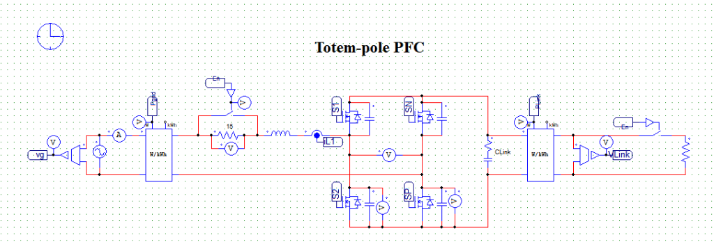
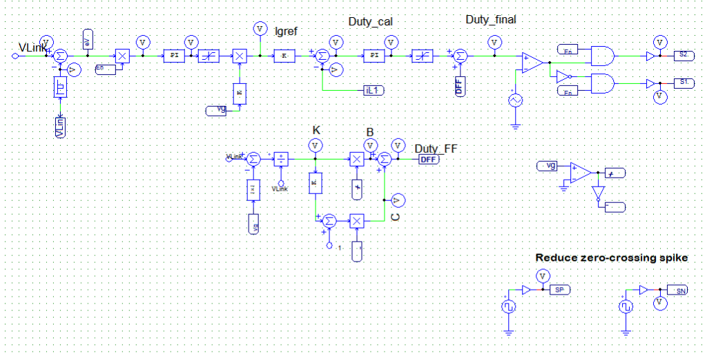
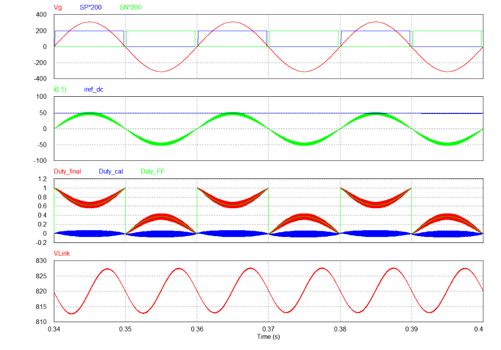

# Totempole Boost PFC - Simulation & Analysis

This document provides a theoretical overview, operating principles, and simulation results analysis for the **Totempole Boost Power Factor Correction (PFC)** topology, focusing on the control strategy used to mitigate the inductor current spike at the zero-crossing (ZC) points.

---

## 1. Overview & Operating Principle

The **Totempole Boost PFC** is an advanced bridgeless PFC topology. By eliminating the conventional input diode bridge rectifier, it significantly minimizes conduction losses and achieves exceptionally high efficiency (typically $>99\%$).

### Converter Structure
The topology consists of two parallel legs connected between the AC grid and the DC bus:
1.  **High-Frequency (HF) Leg:** Employs fast-switching semiconductor devices (such as GaN HEMTs or SiC MOSFETs) operating at high frequencies (kHz) to shape the inductor current ($I_{L1}$) to follow the grid voltage waveform (PFC function).
2.  **Low-Frequency (LF) Leg (Line-Rectification Leg):** Employs low-on-resistance ($R_{DS(on)}$) Si MOSFETs switching at the grid line frequency ($50\text{ Hz} / 60\text{ Hz}$). This leg performs active rectification for the positive and negative half-cycles of the grid voltage.

Below is the schematic diagram of the Totempole Boost PFC power circuit:

---

## 2. Zero-Crossing Current Spike Issue (ZC Spike)

In a Totempole PFC, large current spikes and distortion commonly occur in the inductor current when the grid voltage crosses zero (Zero-Crossing - ZC). The primary causes are:
*   **Parasitic Output Capacitance ($C_{oss}$):** The energy stored in the parasitic output capacitance of the HF switches discharging abruptly when the grid polarity changes.
*   **Controller Delay:** The response time delay of the current loop controller at the polarity reversal point.
*   **Commutation Dead-time:** The transition delay required for the low-frequency switches, which temporarily interrupts the current path.

---

## 3. Zero-Crossing Current Spike Mitigation Strategy

To fully eliminate the current spikes at ZC, the control algorithm implemented in the simulation coordinates the low-frequency and high-frequency switch operations:

### a. Low-Frequency Switches Control (LF: SP & SN)
*   **Early Turn-off:** The active LF switch (e.g., $SP$ during the positive half-cycle) is turned OFF **before** the grid voltage reaches the ZC point.
*   **Delayed Turn-on:** The subsequent LF switch (e.g., $SN$ for the negative half-cycle) is turned ON only **after** the grid voltage has passed the ZC point by a safety margin.
*   This creates a **blanking zone** (dead-time region) around the ZC where both LF switches are OFF.

### b. Commutation Diode Support
*   During the blanking zone around ZC (when both $SP$ and $SN$ are OFF), the grid current flows through the **anti-parallel diodes** (or body diodes) of the LF switches.
*   These diodes act as passive line rectifiers during this transient period, allowing natural commutation of the inductor current and preventing voltage spikes or current interruption.

### c. High-Frequency Switches Control (HF)
*   **HF Disable at ZC:** High-frequency switching is completely disabled (shut down) inside the ZC blanking zone. This prevents high-frequency charging and discharging of the $C_{oss}$ capacitors at low input voltages, eliminating the primary cause of ZC current spikes.
*   **Soft-Start Re-activation:** Once the grid voltage exits the ZC blanking zone and enters the next half-cycle, HF switching is re-enabled. Instead of applying the full calculated Duty Cycle immediately, a **soft-start algorithm** gradually ramps the Duty Cycle up from zero. This ensures a smooth increase in inductor current, avoiding any abrupt surges.

### d. Duty Cycle Feedforward ($D_{FF}$)
To enhance the dynamic performance of the current control loop, a polarity-dependent feedforward duty cycle $D_{FF}$ is implemented:
*   For $v_{ac} > 0$ (positive half-cycle):
    $$D_{FF} = 1 - \frac{|v_g|}{V_{Link}}$$
*   For $v_{ac} < 0$ (negative half-cycle):
    $$D_{FF} = \frac{|v_g|}{V_{Link}}$$

The control circuit schematic implemented in the simulation is shown below, detailing the dual-loop control and the ZC spike reduction logic:

---

## 4. Simulation Results & Waveform Analysis

The simulated waveforms of the Totempole Boost PFC employing the ZC mitigation technique are shown below:

### Waveform Breakdown:
1.  **Top Plot (Vg, SP\*200, SN\*200):**
    *   $V_g$ (red line) is the sinusoidal grid voltage.
    *   $SP$ (blue line) and $SN$ (green line) represent the gate drive signals for the positive and negative half-cycle LF switches (scaled by 200).
    *   The blanking zone around the zero-crossings is clearly visible: $SP$ turns off before $V_g$ hits $0\text{ V}$, and $SN$ turns on only after $V_g$ has fully transitioned into the negative half-cycle.
2.  **Second Plot ($I(L_1)$, $I_{ref\_dc}$):**
    *   $I(L_1)$ (green line) is the inductor current, which is clean and sinusoidal, yielding high power factor.
    *   **At the zero-crossing points, the grid current transitions smoothly without any current spikes.**
3.  **Third Plot (Duty_final, Duty_cal, Duty_FF):**
    *   `Duty_final` (red) is the final duty cycle applied to the HF switches.
    *   `Duty_cal` (blue) is the closed-loop calculated duty cycle.
    *   `Duty_FF` (green) is the feedforward duty cycle.
    *   The smooth transitions of `Duty_final` at the ZC boundaries demonstrate the soft-start and disable features in action.
4.  **Fourth Plot (VLink):**
    *   The output DC link voltage $V_{Link}$ (red) is regulated around a mean value of $820\text{ V}$ with a typical $100\text{ Hz}$ ripple oscillating between $813\text{ V}$ and $827\text{ V}$.

---

## 5. Advantages & Disadvantages

### Advantages
*   **High Efficiency:** Eliminating the diode bridge reduces conduction losses to a minimum.
*   **Superior Current Quality:** The ZC spike mitigation ensures a smooth inductor current, low THD, and high PF.
*   **Component Safety:** Reduces voltage and current stress on semiconductor switches, increasing system reliability and lowering EMI.

### Disadvantages
*   **Control Complexity:** Requires precise grid voltage sensing, dead-time management, and soft-start coordination.
*   **Component Cost:** Demands expensive wide-bandgap (GaN/SiC) devices for the high-frequency stage to unlock full efficiency potential.
