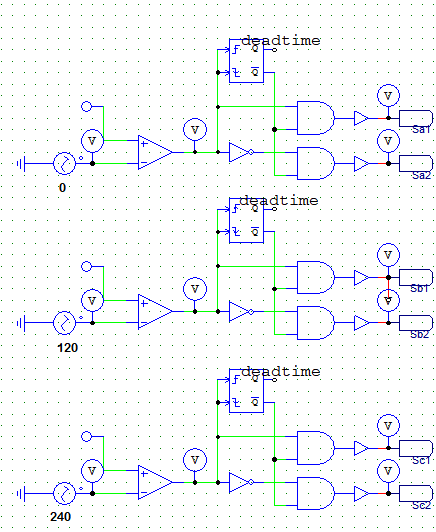
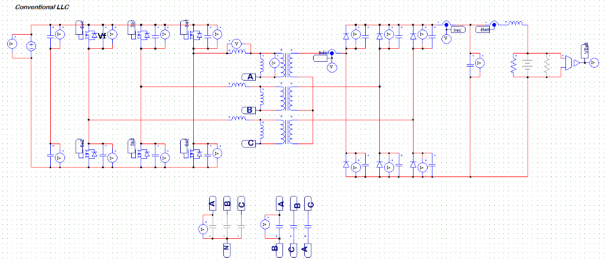
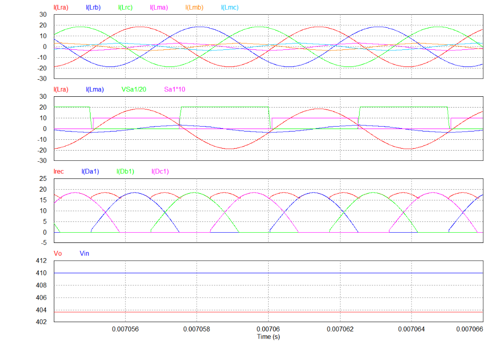
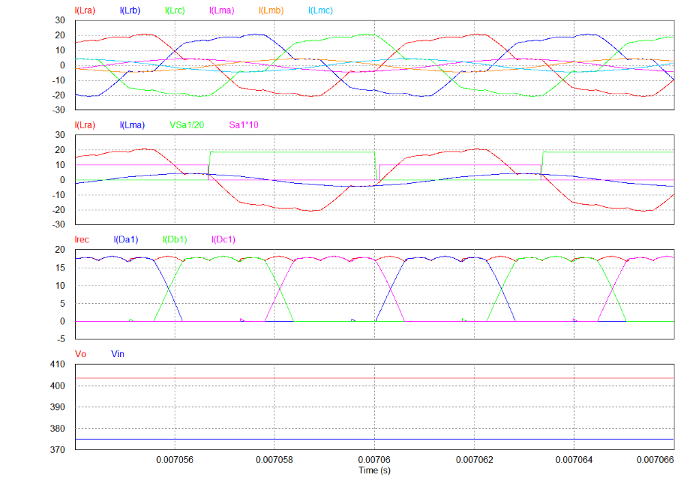
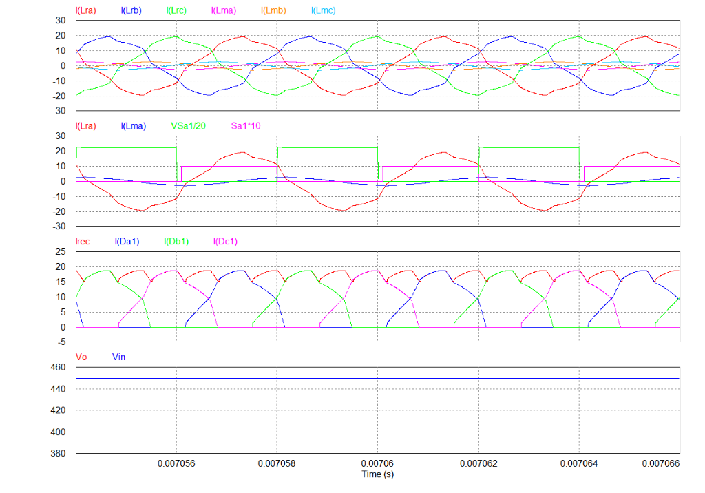

# Three-Phase LLC Resonant Converter - Simulation & Analysis

This document provides a theoretical overview, design calculations, operating principles, and detailed simulation waveform analysis for the **Three-Phase LLC Resonant Converter**. The study compares a conventional Wye-Wye (Y-Y) diode-rectified three-phase LLC configuration with the design considerations from Infineon's **EVAL-5K5W-3PH-LLC-SIC2** evaluation board.

---

## 1. Overview & Operating Principle

The **Three-Phase LLC Resonant Converter** is a high-power DC-DC converter topology widely used in EV onboard chargers (OBC), server power supplies, and high-power industrial battery chargers. By interleaving three resonant phases with a $120^\circ$ phase shift, this topology offers several distinct advantages over standard single-phase LLC converters:

*   **Significantly Lower Output Ripple:** The interleaved current injection from three phases cancels out a large portion of the output current ripple. The ripple frequency is increased to six times the switching frequency ($6 \cdot f_s$), dramatically reducing the filter capacitance requirements ($C_o$).
*   **Reduced Component Stress:** The total output power is shared equally among three phases, allowing the primary-side switches and secondary-side rectifiers to be rated for lower currents.
*   **High Power Density:** Interleaving allows for smaller individual magnetic components (inductors and transformers) and enables integrated magnetic packaging.

### Reference Design vs. Simulation Model
The design parameters in this analysis are based on the **Infineon EVAL-5K5W-3PH-LLC-SIC2** evaluation board. The key differences between the reference board and the user's simulation model are highlighted below:

1.  **Rectification Topology:**
    *   **Infineon Reference Board:** Uses **three separate full-bridge synchronous rectifiers (SR)** on the secondary side, utilizing low-on-resistance ($1.8\text{ m}\Omega$) 80 V OptiMOS MOSFETs. This maximizes efficiency to a peak of nearly 99%.
    *   **Simulation Model:** Employs a **conventional three-phase Wye-connected secondary with a single 6-diode rectifier bridge**. This is a classic, simplified configuration that reduces controller and circuit complexity while validating the basic three-phase resonant power transfer.
2.  **Resonant Capacitor Connection:**
    *   **Infineon Reference Board:** Arranges the resonant capacitors in a **Delta ($\Delta$) connection**.
    *   **Simulation Model:** Provides options for Wye or Delta resonant capacitor configurations (configured using external phase nodes $A, B, C$).

---

## 2. Design Specifications & Parameter Calculations

The electrical specifications and resonant tank parameters are summarized in the table below:

| Parameter | Symbol | Value | Unit |
| :--- | :---: | :---: | :---: |
| DC Input Voltage (Nominal / Range) | $V_{in}$ | 410 (375 - 450) | $\text{V}_{dc}$ |
| Regulated Output DC Voltage | $V_o$ | ~400 | $\text{V}_{dc}$ |
| Nominal Resonant Frequency | $f_r$ | 200 | $\text{kHz}$ |
| Magnetizing Inductance | $L_m$ | 63 | $\mu\text{H}$ |
| Resonant Inductance | $L_r$ | 7.1 | $\mu\text{H}$ |
| Resonant Capacitance | $C_r$ | 90 | $\text{nF}$ |
| Transformer Turns Ratio ($N_p : N_s$) | $n$ | 1.0 | - |
| Leg Deadtime | $t_{dead}$ | 100 | $\text{ns}$ |

### Resonant Frequency Calculation
The nominal resonant frequency of the tank ($L_r$ and $C_r$) is calculated as:

$$f_r = \frac{1}{2\pi \sqrt{L_r \cdot C_r}}$$

Substituting $L_r = 7.1\text{ }\mu\text{H}$ and $C_r = 90\text{ nF}$:

$$f_r = \frac{1}{2\pi \sqrt{7.1 \cdot 10^{-6}\text{ H} \cdot 90 \cdot 10^{-9}\text{ F}}} = \frac{1}{2\pi \sqrt{6.39 \cdot 10^{-13}}} \approx 199.13\text{ kHz} \approx 200\text{ kHz}$$

### Magnetizing Inductance Ratio
The ratio of magnetizing inductance to resonant inductance ($k$) is defined as:

$$k = \frac{L_m}{L_r} = \frac{63\text{ }\mu\text{H}}{7.1\text{ }\mu\text{H}} \approx 8.87$$

A higher $k$ ratio yields a narrower frequency range to regulate the output voltage but increases efficiency at resonance by reducing the magnetizing current (circulating current). A ratio of $8.87$ provides a balanced frequency range with low circulating losses, suitable for narrow input voltage variations.

### Equivalent AC Resistance ($R_{ac}$) for Wye-Wye Connection
Using the First Harmonic Approximation (FHA), the non-linear three-phase diode bridge rectifier and load resistance ($R_o$) are modeled as an equivalent per-phase AC resistance ($R_{ac}$). For a Wye-Wye transformer connection with a three-phase diode bridge rectifier:

$$R_{ac} = \frac{6}{\pi^2} \cdot n^2 \cdot R_o \approx 0.608 \cdot n^2 \cdot R_o$$

Where:
*   $R_o = V_o / I_o$ is the output DC load resistance.
*   $n = N_p / N_s$ is the turns ratio.

---

## 3. Resonant Capacitor Delta ($\Delta$) Connection Advantages

In the Infineon EVAL-5K5W-3PH-LLC-SIC2 board, the resonant capacitors are connected in Delta ($\Delta$) rather than Wye (Y). This configuration provides major benefits:

```
        Delta Connection (Δ)                    Wye Connection (Y)
             Phase A                                 Phase A
                o                                       o
               / \                                      |
             Cr   Cr                                   [Cr]
             /     \                                    |
  Phase B   o -Cr- o   Phase C               Phase B o--|--o Phase C
                                                        |
                                                       (N) Neutral
```

1.  **Capacitance Reduction (Saving PCB Space):**
    By transforming the resonant capacitors from Wye to Delta, the required capacitor value for the same resonant impedance is reduced by a factor of 3:
    $$C_{r,\Delta} = \frac{C_{r,Y}}{3}$$
    This allows the use of smaller-sized capacitors, saving significant board space.
2.  **Reduced RMS Current Stress:**
    The RMS current flowing through each capacitor in the Delta connection is reduced by a factor of $\sqrt{3}$ compared to the Wye line current:
    $$I_{Cr,\Delta} = \frac{I_{Cr,Y}}{\sqrt{3}}$$
    This leads to lower $I^2 \cdot \text{ESR}$ conduction losses in the capacitors, improving thermal performance and reliability.
3.  **Elimination of DC Bias Voltage Offset:**
    *   In a **Wye connection**, the neutral point $N$ sits at a DC potential of $V_{in}/2$. The resonant capacitors must therefore block a continuous DC offset voltage of $V_{in}/2$ in addition to their high-frequency AC ripple.
    *   In a **Delta connection**, there is no neutral point. The capacitors are connected line-to-line. Since the three phases are symmetrical, the DC potential difference between any two phases is zero. Thus, the capacitors only block AC voltage, eliminating DC bias voltage stress. This prevents the capacitance loss commonly seen in multi-layer ceramic capacitors (MLCC) under high DC bias.

---

## 4. Control Circuit & Switching Pulse Generation

To drive the three-phase bridge inverter, three-phase symmetrical square waves with $120^\circ$ phase shifts are generated. The control logic schematic is illustrated below:



### Symmetrical Gate Signals with Deadtime
The switching frequency ($f_s$) determines the output voltage gain. Symmetrical modulation ($50\%$ duty cycle minus deadtime) is applied to each inverter leg:
*   **Phase A:** Driven by $S_{a1}$ and $S_{a2}$ ($0^\circ$ reference phase).
*   **Phase B:** Driven by $S_{b1}$ and $S_{b2}$ (phase-shifted by $120^\circ$).
*   **Phase C:** Driven by $S_{c1}$ and $S_{c2}$ (phase-shifted by $240^\circ$).

### Deadtime Logic Implementation
To prevent shoot-through (short-circuiting the DC bus) in each half-bridge, a deadtime block is implemented. The input square wave is split:
1.  A delay block shifts the rising edge of the signal.
2.  The delayed signal is combined with the original signal using an **AND** gate to generate the active gate signal.
3.  An identical process is applied to the inverted signal to generate the complementary gate signal.
4.  This hardware-based blanking time ($t_{dead} = 100\text{ ns}$) ensures the top switch is completely off before the bottom switch turns on.

---

## 5. Simulation Results & Waveform Analysis

The behavior of the Three-Phase LLC resonant converter is evaluated under three distinct operating regions: at resonance ($f_s = f_r$), sub-resonant (boost mode, $f_s < f_r$), and super-resonant (buck mode, $f_s > f_r$). The circuit schematic used in the simulation is shown below:



---

### Case 1: Resonant Operation ($f_s = f_r = 200\text{ kHz}$)
*   **Operating Parameters:** $V_{in} = 410\text{ V}$, $V_o \approx 403.7\text{ V}$, $f_s = 200\text{ kHz}$
*   **Gain:** $M = \frac{V_o}{V_{in}/n} = \frac{403.7}{410} \approx 0.985 \approx 1.0$ (Nominal unity gain region)

The simulation waveforms at resonance are shown below:



#### Waveform Details:
*   **Resonant Currents (Top Panel):** The phase resonant currents $I(L_{ra})$ (red), $I(L_{rb})$ (blue), and $I(L_{rc})$ (green) are pure, balanced sinusoids peak-rated at $20\text{ A}$, phase-shifted by $120^\circ$.
*   **Switching & ZVS (Second Panel):** The switch voltage $V_{Sa1}/20$ (green) and gate pulse $Sa1 \cdot 10$ (pink) demonstrate Zero-Voltage Switching (ZVS) on the primary side. When the gate pulse goes high, the resonant current $I(L_{ra})$ is negative, flowing through the anti-parallel diode of the switch to clamp the switch voltage to zero before turn-on, eliminating turn-on losses.
*   **Rectifier Diode Currents & ZCS (Third Panel):** Shows the total output rectified current $I_{rec}$ (red) and the individual rectifier diode currents $I(D_{a1})$ (blue), $I(D_{b1})$ (green), and $I(D_{c1})$ (pink) for each phase.
    *   **ZCS Verification:** Each diode current (e.g., $I(D_{a1})$) is a half-sinusoid. At resonance ($f_s = f_r$), the diode current naturally decays to exactly $0\text{ A}$ with a smooth slope at the end of the switching half-cycle (the exact instant when $I(L_{ra}) = I(L_{ma})$). Since the current reaches zero before the primary switches commute and reverse voltage is applied, **Zero-Current Switching (ZCS) is fully achieved**, eliminating diode reverse recovery losses.
    *   **Interleaved Ripple:** Due to the $120^\circ$ phase shift, the individual diode currents overlap, keeping the total rectified output current $I_{rec}$ high with a small $1.2\text{ MHz}$ ripple ($6 \cdot f_s$) oscillating between $16\text{ A}$ and $18.5\text{ A}$.
*   **Voltages (Bottom Panel):** $V_{in}$ is fixed at $410\text{ V}$ (blue), and $V_o$ is stable at $403.7\text{ V}$ (red). The slight difference between $V_{in}$ and $V_o$ represents the voltage drops across the switches ($R_{on}$), rectifiers ($V_f \approx 2.5\text{ V}$ per diode, $5.0\text{ V}$ total drop for the bridge), and magnetic winding resistances.

---

### Case 2: Sub-Resonant / Boost Operation ($f_s = 150\text{ kHz} < f_r$)
*   **Operating Parameters:** $V_{in} = 375\text{ V}$, $V_o \approx 403.7\text{ V}$, $f_s = 150\text{ kHz}$
*   **Gain:** $M = \frac{V_o}{V_{in}/n} = \frac{403.7}{375} \approx 1.077 > 1.0$ (Boost mode to compensate for low input voltage)

The simulation waveforms below resonance are shown below:



#### Waveform Details:
*   **Resonant Currents (Top Panel):** The resonant currents $I(L_{ra})$, $I(L_{rb})$, and $I(L_{rc})$ are no longer pure sinusoids. They exhibit a distinct change in slope near the end of each half-cycle.
*   **Primary Switching & ZVS (Second Panel):** Symmetrical ZVS is maintained on the primary side as the commutated current is inductive.
*   **Rectifier Diode Currents & ZCS (Third Panel):** Shows $I_{rec}$ (red) along with the individual phase diode currents $I(D_{a1})$ (blue), $I(D_{b1})$ (green), and $I(D_{c1})$ (pink).
    *   **ZCS and Clamped Interval:** Because $f_s < f_r$, the resonant current $I(L_{ra})$ (red) merges with the magnetizing current $I(L_{ma})$ (blue) *before* the switching transition occurs. When they meet, the secondary diode current (e.g., $I(D_{a1})$) falls to exactly $0\text{ A}$ and remains flat at zero for a **dead-band interval** prior to primary leg commutation. 
    *   This flat-zero current interval guarantees **perfect ZCS** under all load conditions, removing any reverse recovery stress from the diodes.
    *   **Output Ripple:** The discontinuous phase current causes the total output current $I_{rec}$ to exhibit a "double bump" ripple waveform, oscillating between $16.7\text{ A}$ and $18.1\text{ A}$ at $900\text{ kHz}$ ($6 \cdot 150\text{ kHz}$).
*   **Voltages (Bottom Panel):** $V_{in}$ is $375\text{ V}$ and $V_o$ is boosted to $403.7\text{ V}$.

---

### Case 3: Super-Resonant / Buck Operation ($f_s = 250\text{ kHz} > f_r$)
*   **Operating Parameters:** $V_{in} = 450\text{ V}$, $V_o \approx 400.8\text{ V}$, $f_s = 250\text{ kHz}$
*   **Gain:** $M = \frac{V_o}{V_{in}/n} = \frac{400.8}{450} \approx 0.891 < 1.0$ (Buck mode to regulate output under high input voltage)

The simulation waveforms above resonance are shown below:



#### Waveform Details:
*   **Resonant Currents (Top Panel):** The resonant currents are sinusoidal but truncated because the switching period is shorter than the natural resonance period.
*   **Primary Switching & ZVS (Second Panel):** Symmetrical primary ZVS is achieved with very low circulating losses, leading to high primary efficiency.
*   **Rectifier Diode Currents & Loss of ZCS (Third Panel):** Shows $I_{rec}$ (red) and the individual phase diode currents $I(D_{a1})$ (blue), $I(D_{b1})$ (green), and $I(D_{c1})$ (pink).
    *   **Loss of ZCS:** The resonant current $I(L_{ra})$ is interrupted *before* it can decay to the magnetizing current $I(L_{ma})$. As a result, the secondary diode current is forced to shut off abruptly (hard commutation) from a high positive value of approximately **$8\text{ A}$** (as seen by the sharp vertical drop in $I(D_{a1})$).
    *   This rapid turn-off causes a **loss of ZCS** at the secondary side. In physical circuits, this hard commutation results in severe reverse recovery current spikes and high-voltage ringing.
    *   **Output Ripple:** The total rectified current $I_{rec}$ has a triangular ripple waveform oscillating between $15\text{ A}$ and $18.8\text{ A}$ at $1.5\text{ MHz}$ ($6 \cdot 250\text{ kHz}$).
*   **Voltages (Bottom Panel):** $V_{in}$ is $450\text{ V}$ and $V_o$ is bucked to $400.8\text{ V}$.

---

## 6. Summary of Operating Regions

The characteristics of the three operating regions are compared in the table below:

| Feature | Sub-Resonant ($f_s < f_r$) | Resonant ($f_s = f_r$) | Super-Resonant ($f_s > f_r$) |
| :--- | :---: | :---: | :---: |
| **Switching Frequency ($f_s$)** | $150\text{ kHz}$ | $200\text{ kHz}$ | $250\text{ kHz}$ |
| **Input Voltage ($V_{in}$)** | $375\text{ V}$ | $410\text{ V}$ | $450\text{ V}$ |
| **Output Voltage ($V_o$)** | $403.7\text{ V}$ | $403.7\text{ V}$ | $400.8\text{ V}$ |
| **Voltage Gain ($M$)** | $1.077$ (Boost) | $0.985 \approx 1.0$ (Unity) | $0.891$ (Buck) |
| **Primary-Side ZVS** | Achieved | Achieved | Achieved |
| **Secondary-Side ZCS** | Achieved | Achieved | Lost (Hard Commutation) |
| **Resonant Current Shape** | Quasi-sinusoidal (clamped) | Pure Sinusoidal | Truncated Sinusoidal |
| **Circulating Losses** | High | Minimal | Very Low |
| **Secondary Recovery Losses** | None | None | High (requires SiC/Fast Diodes) |
| **Output Ripple Waveform** | Double-bump | Hex-phase sinusoidal | Triangular |

---

## 7. References

For further details on three-phase LLC design, magnetics integration, and synchronous rectification control, refer to:
*   [Infineon EVAL-5K5W-3PH-LLC-SIC2 Evaluation Board Application Note](https://www.infineon.com/assets/row/public/documents/24/42/infineon-evaluation-board-eval-5k5w-3ph-llc-sic2-applicationnotes-en.pdf)
*   [Texas Instruments: Designing a Three-Phase LLC Resonant Converter (SLUP395)](https://www.ti.com/lit/pdf/slup395)
